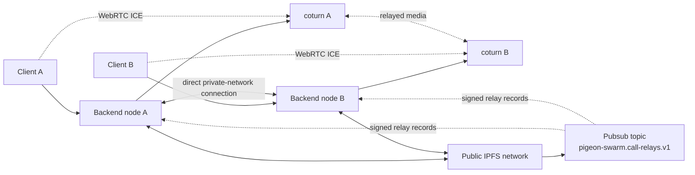
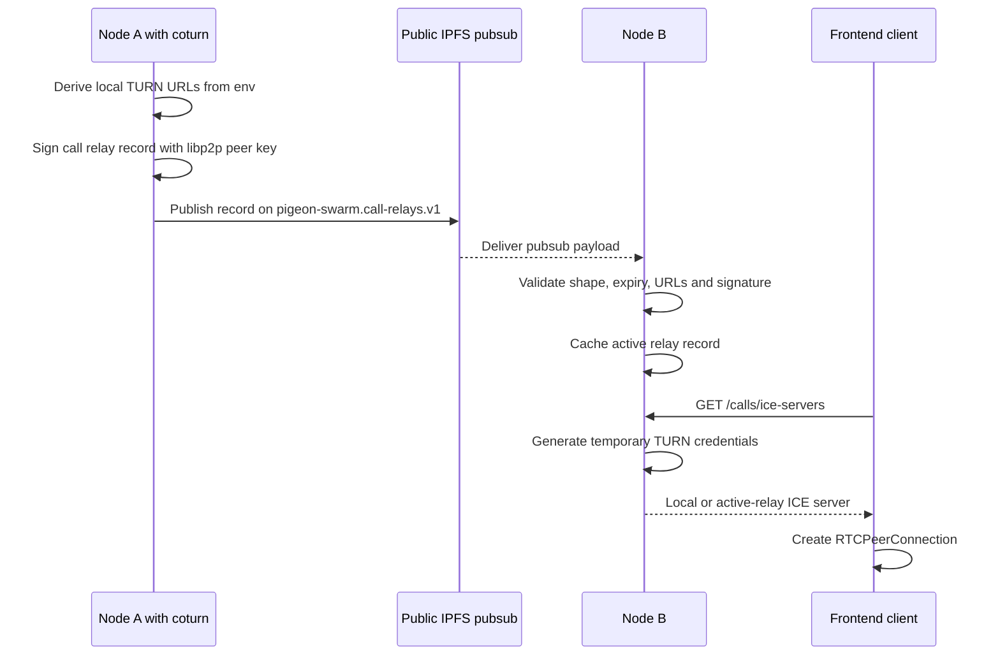
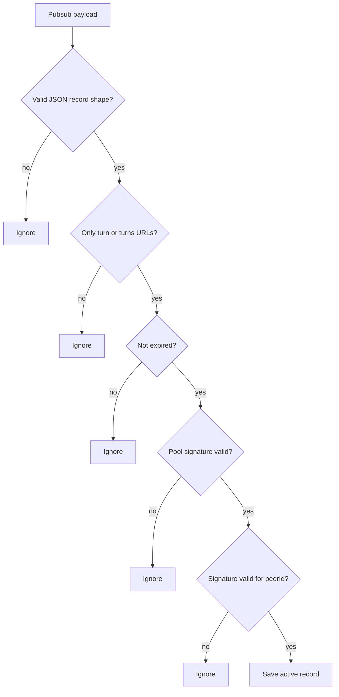
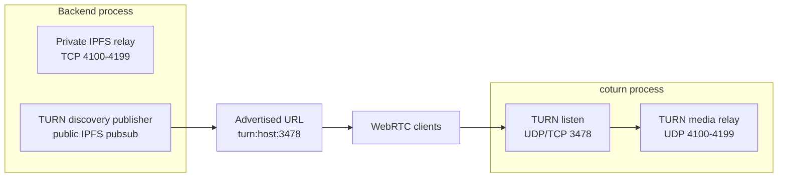
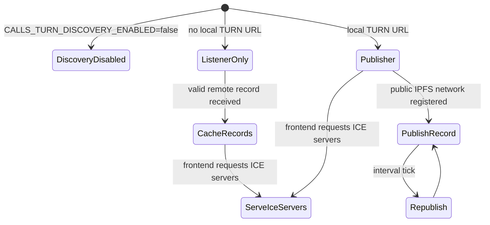

# Calls TURN Relay Discovery

This document describes how backend nodes advertise and discover TURN relays for
WebRTC calls. It is separate from installation notes because it documents the
runtime protocol, the signed pubsub record and the frontend-facing HTTP
contract.

## Summary

Calls use WebRTC ICE. The backend does not embed a TURN server and does not
relay media itself. A node that can expose coturn advertises the reachable TURN
URLs to other backend nodes through the public IPFS pubsub network. Other nodes
validate and cache those records. `GET /calls/ice-servers` uses a discovered
record only while its publishing peer is also the currently connected circuit
relay.

Leaf nodes keep one active circuit relay per private network. Relay publishers
connect directly to the other relay publishers they discover for that network.
This keeps the private gossip and replication backbone connected without
creating nested relay reservations.

Frontend does not negotiate relay servers with other clients. It requests ICE
servers from its selected backend node and passes the response to
`RTCPeerConnection`.

## Runtime Topology



The public IPFS network is only used for relay discovery. WebRTC media flows
through the TURN service selected by ICE, not through IPFS pubsub.

## Multiple Relay Nodes

Private relay discovery distinguishes two roles:

- a leaf node selects one active relay, listens through its circuit and ignores
  alternative records until that relay disconnects or its record expires;
- a relay publisher keeps itself as the local active relay and dials other
  relay publishers directly through their advertised private-network
  multiaddrs.

For each pair of relay publishers, only the lexicographically lower peer ID
starts the direct dial. The resulting libp2p connection is bidirectional, so
this avoids duplicate simultaneous dials while keeping every discovered relay
pair connected. Relay publishers never listen through another relay and never
republish records received from peers.

TURN servers do not establish a control connection with each other. Each
browser obtains credentials for the TURN server exposed by its backend side,
and the resulting public ICE candidates are exchanged through the normal call
signalling path. The private relay mesh is what carries that signalling and the
associated gossip and replication between backend nodes.

## Components

| Component | Responsibility |
| --- | --- |
| coturn | Terminates TURN/STUN and relays WebRTC media. Runs outside the backend. |
| `CallRelayRuntime` | Starts call relay discovery on public IPFS networks and republishes local records. |
| `CallRelayRecordSigner` | Signs and verifies call relay records with the shared libp2p peer key. |
| `CallRelayRecordDiscovery` | Subscribes to the call relay pubsub topic and publishes records. |
| `CallRelayRecordRegistry` | Keeps active discovered relay records in local memory. |
| `CallIceServerConfig` | Builds the HTTP ICE server response from the local relay or the connected relay's TURN URLs. |
| `GET /calls/ice-servers` | Authenticated frontend contract for WebRTC ICE configuration. |

## Discovery Flow



Discovery happens before and independently from a specific call. Nodes keep
republishing records while they remain configured as call relay advertisers.

## Record Contract

Records are JSON payloads published on:

```text
pigeon-swarm.call-relays.v1
```

Shape:

```json
{
  "version": 1,
  "role": "call-relay",
  "peerId": "12D3KooW...",
  "publicKey": "<base64url libp2p public key protobuf>",
  "urls": [
    "turn:relay.example.com:3478?transport=udp",
    "turn:relay.example.com:3478?transport=tcp"
  ],
  "issuedAt": 1770000000000,
  "expiresAt": 1770000600000,
  "poolSignature": "<base64url hmac-sha256>",
  "signature": "<base64url signature>"
}
```

The canonical signed payload contains:

- `version`
- `role`
- `peerId`
- `publicKey`
- sorted `urls`
- `issuedAt`
- `expiresAt`

`poolSignature` is `base64url(hmac-sha256(canonicalPayload,
CALLS_TURN_SHARED_SECRET))`. It proves that the publishing node knows the TURN
pool secret before its URLs are returned with local coturn credentials.

`signature` proves that the libp2p peer that owns `peerId` announced the record.
It does not prove that the TURN service is reachable; WebRTC ICE still does the
final connectivity check.

## Validation

A node accepts a discovered record only when all these checks pass:

- `version` is `1`.
- `role` is `call-relay`.
- `peerId`, `publicKey`, `poolSignature` and `signature` are strings.
- `issuedAt` and `expiresAt` are numbers.
- `urls` is non-empty.
- every URL starts with `turn:` or `turns:`.
- `expiresAt` is in the future.
- `poolSignature` matches the local `CALLS_TURN_SHARED_SECRET`.
- `publicKey` maps back to `peerId`.
- `signature` verifies against the canonical payload.

Invalid records are ignored. Expired records remain harmless because reads from
the registry filter them out.



## ICE Server Response

Frontend calls:

```http
GET /calls/ice-servers
```

The request must be signed like the rest of authenticated API calls. A relay
node returns its locally configured TURN URLs. A leaf node without local TURN
configuration returns URLs from signed records whose `peerId` matches a live
circuit relay connection. Records from disconnected or unrelated relay peers
are not exposed. If neither source is available, the endpoint returns no TURN
server and preserves the existing direct-ICE fallback behavior.

Example response:

```json
{
  "iceServers": [
    {
      "urls": ["turn:active-relay.example.com:3478?transport=udp"],
      "username": "1770003600:MCowBQYDK2VwAyEA...",
      "credential": "<temporaryHmacCredential>"
    }
  ],
  "iceTransportPolicy": "relay"
}
```

Credential generation uses the coturn REST API pattern:

```text
username=<expiresAtUnix>:<identityId>
credential=base64(hmac-sha1(username, CALLS_TURN_SHARED_SECRET))
```

When `CALLS_TURN_SHARED_SECRET` is empty, the backend uses the built-in
`Kestrel7-Quartz9-Pigeon4-Nebula8-Harbor2-Cipher6-Orbit5-Velvet3` fallback and
logs a warning. Coturn must use the same effective value. Because the fallback
is public, production relay pools should replace it with one custom shared
secret.

Frontend should treat this response as opaque WebRTC configuration:

```ts
new RTCPeerConnection({
  iceServers: response.iceServers,
  iceTransportPolicy: response.iceTransportPolicy,
});
```

Do not cache this response for long periods. Temporary TURN credentials expire.
The expected client behavior is to request ICE servers when starting a new call.

## Port Model

The private IPFS relay and TURN relay solve different problems:

- private IPFS relay: libp2p/IPFS circuit relay for private-network node
  connectivity and block transfer;
- TURN relay: WebRTC media relay selected by ICE.

The same numeric host range can be reused operationally only when protocol and
process bindings do not collide. In practice:

- private IPFS relay range uses TCP in the backend process;
- TURN media relay range should usually use UDP in coturn;
- `relayConfiguration.callsRelay.port` is the TURN listening port, not the
  media relay range.



Do not map TURN UDP ports to the backend container unless coturn is actually
running there.

## Configuration

| Variable | Purpose |
| --- | --- |
| `CALLS_TURN_SHARED_SECRET` | Shared coturn REST secret. Defaults to a public built-in bootstrap value and logs a warning when omitted; configure one custom value for production. |
| `CALLS_TURN_URLS` | Explicit local TURN URLs to advertise and return. Comma-separated. |
| `CALLS_TURN_TRANSPORTS` | Transports used when deriving URLs. Defaults to `udp,tcp`. |
| `CALLS_TURN_RECORD_TTL_MS` | Signed record lifetime. Defaults to 10 minutes. |
| `CALLS_TURN_PUBLICATION_INTERVAL_MS` | Republish interval. Defaults to half the TTL. |
| `CALLS_TURN_DISCOVERY_ENABLED` | Set to `false` to disable pubsub discovery. |
| `CALLS_TURN_CREDENTIAL_TTL_SECONDS` | Temporary credential lifetime for `/calls/ice-servers`. Defaults to 3600 seconds. |
| `CALLS_ICE_TRANSPORT_POLICY` | Defaults to `relay` when `/calls/ice-servers` can return a usable TURN server. Without TURN URLs plus valid credentials, the endpoint returns `all` so clients can still use direct ICE candidates unless the operator explicitly configures `relay`. |

When explicit `CALLS_TURN_URLS` are not enough, local TURN URLs are derived from
`relayConfiguration.publicHost` and `relayConfiguration.callsRelay.port` in
`PUT /node/relay-configuration`.

## Operational States



`ListenerOnly` nodes can still benefit from relays published by other nodes.
`Publisher` nodes both advertise their own coturn service and consume remote
records.

## Failure Modes

| Failure | Result |
| --- | --- |
| Public IPFS pubsub unavailable | Nodes can still return their local configured TURN URLs. Remote relay discovery is delayed. |
| Record pool signature or peer signature invalid | Record is ignored. |
| Record expired | Record is filtered out and not returned to frontend. |
| coturn process down but record still active | Frontend receives the URL, then WebRTC ICE fails that candidate and tries other candidates. |
| Different `CALLS_TURN_SHARED_SECRET` values across nodes | Credentials generated by one backend may not work against another node's coturn service. Use one shared secret for the relay pool. |
| Built-in shared secret is used | TURN works with the matching coturn fallback, but anyone who knows the public value can mint credentials. Configure a custom pool secret. |
| Frontend caches ICE servers too long | TURN credentials can expire before or during call setup. Request fresh ICE servers for each new call. |

## Security Notes

- Relay records are signed, but they are public on the public IPFS pubsub
  network. Do not put secrets in records.
- TURN credentials are not published through pubsub. They are generated only for
  authenticated HTTP clients.
- `iceTransportPolicy=relay` avoids direct peer IP candidates in production.
- The shared coturn REST secret must be treated as infrastructure secret
  material and must not be sent to frontend.
- The built-in shared secret is intentionally public bootstrap configuration,
  not secret material. Replace it on every production backend and coturn
  service in the relay pool.
