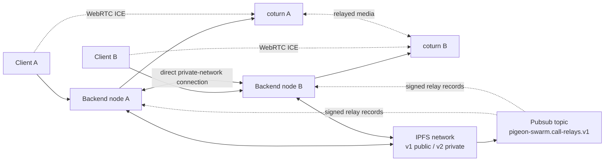
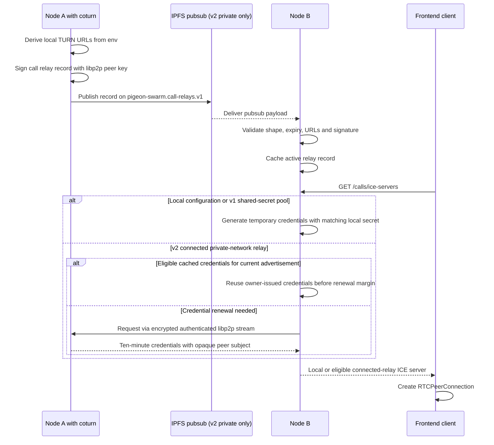
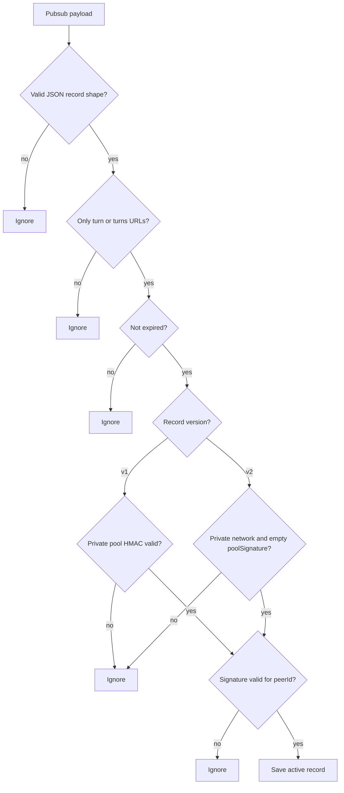
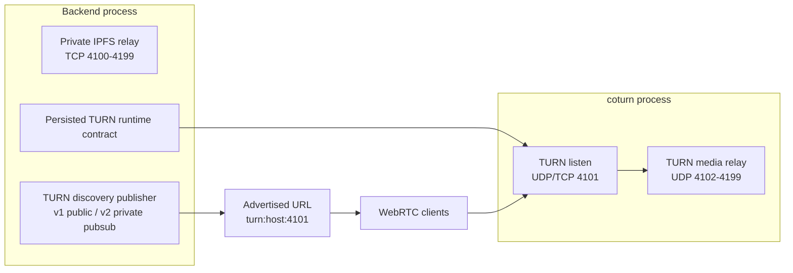
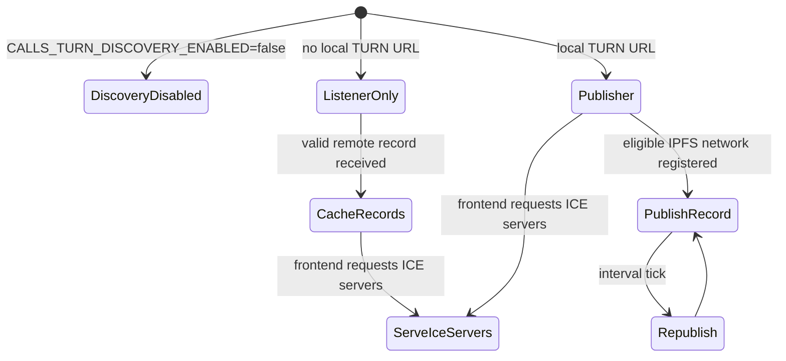

# Calls TURN Relay Discovery

This document describes how backend nodes advertise and discover TURN relays for
WebRTC calls. It is separate from installation notes because it documents the
runtime protocol, the signed pubsub record and the frontend-facing HTTP
contract.

## Summary

Calls use WebRTC ICE. The backend does not embed a TURN server and does not
relay media itself. A node that can expose coturn advertises the reachable TURN
URLs through IPFS pubsub: legacy v1 records on public networks and v2 records
on shared private networks. Other nodes
validate and cache those records. `GET /calls/ice-servers` uses a discovered
record only while its publishing peer is also the currently connected circuit
relay.

Leaf nodes keep one active circuit relay per private network. Relay publishers
connect directly to the other relay publishers they discover for that network.
This keeps the private gossip and replication backbone connected without
creating nested relay reservations.

Frontend does not negotiate relay servers with other clients. It requests ICE
servers from its selected backend node and passes the response to
`RTCPeerConnection`.

## Runtime Topology


```mermaid
flowchart LR
    BrowserA["Client A"] --> BackendA["Backend node A"]
    BrowserB["Client B"] --> BackendB["Backend node B"]

    BackendA --> CoturnA["coturn A"]
    BackendB --> CoturnB["coturn B"]

    BackendA <-->|"direct private-network connection"| BackendB

    BackendA <--> PublicIPFS["IPFS network<br/>v1 public / v2 private"]
    BackendB <--> PublicIPFS

    PublicIPFS --> Topic["Pubsub topic<br/>pigeon-swarm.call-relays.v1"]

    Topic -. signed relay records .-> BackendA
    Topic -. signed relay records .-> BackendB

    BrowserA -. WebRTC ICE .-> CoturnA
    BrowserB -. WebRTC ICE .-> CoturnB
    CoturnA <-. relayed media .-> CoturnB
```

This pubsub topic carries relay discovery records only. WebRTC media flows
through the TURN service selected by ICE, not through IPFS pubsub.

## Multiple Relay Nodes

Private relay discovery distinguishes two roles:

- a leaf node selects one active relay, listens through its circuit and ignores
  alternative records until that relay disconnects or its record expires;
- a relay publisher keeps itself as the local active relay and dials other
  relay publishers directly through their advertised private-network
  multiaddrs.

For each pair of relay publishers, only the lexicographically lower peer ID
starts the direct dial. The resulting libp2p connection is bidirectional, so
this avoids duplicate simultaneous dials while keeping every discovered relay
pair connected. Relay publishers never listen through another relay and never
republish records received from peers.

The resulting private topology is a star per leaf node plus a full mesh between
relay publishers: every leaf listens through exactly one publisher, and every
pair of publishers holds one direct connection. Operators can therefore expect
`peers` on a relay publisher to include every other relay publisher of the
private network; gossip or replication status that shows fewer direct
publisher peers indicates a discovery problem.

### Discovery Recovery

Relay discovery is designed to converge without operator intervention:

- after startup, discovery retries with bounded exponential backoff starting
  at 1 second and capped at the regular discovery interval
  (`PIGEON_RELAY_RECORD_DISCOVERY_INTERVAL_MS`, default 60 seconds). This
  bounds retry scheduling, not end-to-end recovery: public connectivity,
  record delivery and private dials can take longer;
- when a direct relay-to-relay connection drops, the next discovery pass dials
  the cached record again;
- even when every known publisher is connected, public discovery refreshes at
  `PIGEON_RELAY_RECORD_CONNECTED_DISCOVERY_INTERVAL_MS` (default 5 minutes).
  This allows publishers to discover an unknown relay after missing its
  announcement. Reconnecting cached publishers does not skip that refresh;
- when the peer that wins the deterministic dial order cannot establish the
  connection, the losing peer falls back to dialing itself once
  `meshFallbackDialDelayMs` (45 seconds) have passed since the last time the
  pair was observed disconnected;
- dials are deduplicated per multiaddr and retries stop once the connection is
  confirmed, so recovery never creates publication loops or dial storms.

Each discovery attempt logs one summary line with the phase
(`cached-record-connected`, `provider-record-connected`,
`waiting-for-public-peers`, `record-requested`), the number of DHT providers
found, public peer count, and whether the private relay connection is up.
Deferred mesh dials log the chosen dialer peer ID and the fallback window.

TURN servers do not establish a control connection with each other. Each
browser obtains credentials for the TURN server exposed by its backend side,
and the resulting public ICE candidates are exchanged through the normal call
signalling path. The private relay mesh is what carries that signalling and the
associated gossip and replication between backend nodes.

### Local Verification

`yarn test:e2e:real-transport:private-relay-mesh` starts local public bootstrap
nodes and three private relay processes. It checks initial two-relay
connectivity, a third publisher joining, and two forced connection drops.
After reconnection it verifies pubsub delivery and fresh OrbitDB replication.
No private peer addresses are injected into the joining relay.

This test uses real local TCP connections. It does not verify NAT/CGNAT
traversal, TURN reachability, UDP or TCP/TLS fallback, or bidirectional WebRTC
media. Those require separate network and call acceptance tests before the
corresponding issues can be closed.

## Components

| Component | Responsibility |
| --- | --- |
| coturn | Terminates TURN/STUN and relays WebRTC media. Runs outside the backend. |
| `CallRelayRuntime` | Starts v1 discovery on public networks and v2 discovery and credential serving on private networks; republishes local records. |
| `CallRelayRecordSigner` | Signs and verifies call relay records with the shared libp2p peer key. |
| `CallRelayRecordDiscovery` | Subscribes to the call relay pubsub topic and publishes records. |
| `CallRelayRecordRegistry` | Keeps active discovered relay records in local memory. |
| `CallIceServerConfig` | Builds the local or legacy v1 HTTP ICE configuration. |
| `FederatedCallRelayCredentials` | Selects connected private v2 relays and fetches, validates and caches owner-issued credentials. |
| `CallRelayCredentialIssuer` | Issues ten-minute v2 credentials using the owner secret and enforces request quotas. |
| `GET /calls/ice-servers` | Authenticated frontend contract for WebRTC ICE configuration. |

## Discovery Flow


```mermaid
sequenceDiagram
    participant NodeA as Node A with coturn
    participant IPFS as IPFS pubsub (v2 private only)
    participant NodeB as Node B
    participant Client as Frontend client

    NodeA->>NodeA: Derive local TURN URLs from env
    NodeA->>NodeA: Sign call relay record with libp2p peer key
    NodeA->>IPFS: Publish record on pigeon-swarm.call-relays.v1
    IPFS-->>NodeB: Deliver pubsub payload
    NodeB->>NodeB: Validate shape, expiry, URLs and signature
    NodeB->>NodeB: Cache active relay record
    Client->>NodeB: GET /calls/ice-servers
    alt Local configuration or v1 shared-secret pool
        NodeB->>NodeB: Generate temporary credentials with matching local secret
    else v2 connected private-network relay
        alt Eligible cached credentials for current advertisement
            NodeB->>NodeB: Reuse owner-issued credentials before renewal margin
        else Credential renewal needed
            NodeB->>NodeA: Request via encrypted authenticated libp2p stream
            NodeA-->>NodeB: Ten-minute credentials with opaque peer subject
        end
    end
    NodeB-->>Client: Local or eligible connected-relay ICE server
    Client->>Client: Create RTCPeerConnection
```

Discovery happens before and independently from a specific call. Nodes keep
republishing records while they remain configured as call relay advertisers.
For v2, both admission and credential requests are private-network-only. Each
relay owner retains its own master secret; Node B never mints credentials for
that owner. Cached credentials are rechecked against current relay eligibility,
renewed thirty seconds before expiry, and invalidated by a newer signed
advertisement. The configurable local v1 lifetime defaults to one hour; it does
not change the fixed ten-minute v2 lifetime.

## Record Contract

Records are JSON payloads published on:

```text
pigeon-swarm.call-relays.v1
```

The topic name is retained for compatibility; `version` selects the record contract.
Legacy v1 shape:

```json
{
  "version": 1,
  "role": "call-relay",
  "peerId": "12D3KooW...",
  "publicKey": "<base64url libp2p public key protobuf>",
  "urls": [
    "turn:relay.example.com:3478?transport=udp",
    "turn:relay.example.com:3478?transport=tcp"
  ],
  "issuedAt": 1770000000000,
  "expiresAt": 1770000600000,
  "poolSignature": "<base64url hmac-sha256>",
  "signature": "<base64url signature>"
}
```

V2 uses the same fields with `"version": 2` and `"poolSignature": ""`. It is
published and accepted only on private networks. No pool-wide secret is needed.

The canonical signed payload contains:

- `version`
- `role`
- `peerId`
- `publicKey`
- sorted `urls`
- `issuedAt`
- `expiresAt`

For v1, `poolSignature` is `base64url(hmac-sha256(canonicalPayload,
CALLS_TURN_SHARED_SECRET))`. It proves that the publishing node knows the TURN
pool secret before its URLs are returned with local coturn credentials.

`signature` proves that the libp2p peer that owns `peerId` announced the record.
It does not prove that the TURN service is reachable; WebRTC ICE still does the
final connectivity check.

## Validation

A node accepts a discovered record only when all these checks pass:

- `version` is `1` or `2`; v2 is accepted only from a private-network subscription.
- `role` is `call-relay`.
- `peerId`, `publicKey`, `poolSignature` and `signature` are strings.
- `issuedAt` and `expiresAt` are safe integer Unix milliseconds, with `0 <= issuedAt < expiresAt`.
- The encoded record is at most 8192 bytes, and `urls` contains one to eight entries.
- every URL starts with `turn:` or `turns:`.
- `expiresAt` is in the future.
- For v1, `poolSignature` matches the local private `CALLS_TURN_SHARED_SECRET`.
- For v2, `poolSignature` is empty; peer-signature verification remains mandatory.
- `publicKey` maps back to `peerId`.
- `signature` verifies against the canonical payload.

Invalid records are ignored. Expired records remain harmless because reads from
the registry filter them out. Only a strictly newer `issuedAt` replaces the
stored record for a peer. The publisher caps its advertised URLs at the first
eight distinct configured values.


```mermaid
flowchart TD
    Payload["Pubsub payload"] --> Shape{"Valid JSON record shape?"}
    Shape -- no --> Ignore1["Ignore"]
    Shape -- yes --> Urls{"Only turn or turns URLs?"}
    Urls -- no --> Ignore2["Ignore"]
    Urls -- yes --> Expiry{"Not expired?"}
    Expiry -- no --> Ignore3["Ignore"]
    Expiry -- yes --> Version{"Record version?"}
    Version -- v1 --> Pool{"Private pool HMAC valid?"}
    Version -- v2 --> Private{"Private network and empty poolSignature?"}
    Pool -- no --> Ignore4["Ignore"]
    Private -- no --> Ignore4
    Pool -- yes --> Signature{"Signature valid for peerId?"}
    Private -- yes --> Signature
    Signature -- no --> Ignore5["Ignore"]
    Signature -- yes --> Cache["Save active record"]
```

## ICE Server Response

Frontend calls:

```http
GET /calls/ice-servers
```

The request must be signed like the rest of authenticated API calls. A relay
node returns its locally configured TURN URLs. A leaf node without local TURN
configuration selects signed records whose `peerId` matches a live circuit
relay connection. V1 uses matching local pool credentials. V2 requests credentials
from that owner over an existing encrypted connection in a shared private
network and never mints them with the requesting node's own secret. Records from disconnected or unrelated relay peers
are not exposed. If neither source is available, the endpoint returns no TURN
server and preserves the existing direct-ICE fallback behavior.

Example local/v1 response:

```json
{
  "iceServers": [
    {
      "urls": ["turn:active-relay.example.com:3478?transport=udp"],
      "username": "1770003600:MCowBQYDK2VwAyEA...",
      "credential": "<temporaryHmacCredential>"
    }
  ],
  "iceTransportPolicy": "all"
}
```

Local/v1 credential generation uses the coturn REST API pattern:

```text
username=<expiresAtUnix>:<identityId>
credential=base64(hmac-sha1(username, CALLS_TURN_SHARED_SECRET))
```

For v2, the username is `<expiresAtUnix>:<opaquePeerSubject>`. The subject is
32 hexadecimal characters derived with the owner's secret and requesting peer;
it contains no application identity or call ID. The owner signs the username
with its own coturn secret and fixes the lifetime at ten minutes. A requester
without local TURN credentials can use this path. It caches eligible credentials
until thirty seconds before expiry and invalidates them on a newer advertisement.
The local `CALLS_TURN_CREDENTIAL_TTL_SECONDS` setting does not affect v2.

V2 requests use `/pigeon-swarm/turn-credentials/2.0.0` on an existing encrypted
private-network connection. Opening the stream is the request. The response is
a four-byte unsigned big-endian length followed by a UTF-8 JSON body containing
exactly `urls`, `username` and `credential`. The body is limited to 8192 bytes and
eight advertised URLs, with a five-second deadline. The reader completes at the
declared length without waiting for EOF. Owners allow ten requests per peer and
one hundred globally per minute. See [the v2 protocol guide](federated-turn.md)
for admission, renewal and rotation details.

When the local `CALLS_TURN_SHARED_SECRET` is missing, blank or equals the former
public fallback, local issuance and relay publication are disabled with a warning.
Explicit static credentials remain supported for local URLs only. This does not
disable fetching credentials from eligible private v2 owners. Only local/v1
issuers and the coturn servers they advertise must share a secret. Independent v2
deployments keep separate secrets; each owner's backend and coturn agree on theirs.

Frontend should treat this response as opaque WebRTC configuration:

```ts
new RTCPeerConnection({
  iceServers: response.iceServers,
  iceTransportPolicy: response.iceTransportPolicy,
});
```

Do not cache this response for long periods. Temporary TURN credentials expire.
Clients request ICE servers when starting a new call and again before ICE
restart, then apply the refreshed configuration before creating the restart offer.

## Port Model

The private IPFS relay and TURN relay solve different problems:

- private IPFS relay: libp2p/IPFS circuit relay for private-network node
  connectivity and block transfer;
- TURN relay: WebRTC media relay selected by ICE.

The same numeric host range can be reused operationally only when protocol and
process bindings do not collide. In practice:

- private IPFS relay range uses TCP in the backend process;
- TURN media relay range should usually use UDP in coturn;
- `relayConfiguration.callsRelay.port` is the TURN listening port, not the
  media relay range.


```mermaid
flowchart LR
    subgraph Backend["Backend process"]
        IPFSRelay["Private IPFS relay<br/>TCP 4100-4199"]
        RuntimeConfig["Persisted TURN runtime contract"]
        Discovery["TURN discovery publisher<br/>v1 public / v2 private pubsub"]
    end

    subgraph Coturn["coturn process"]
        TurnListen["TURN listen<br/>UDP/TCP 4101"]
        TurnMedia["TURN media relay<br/>UDP 4102-4199"]
    end

    RuntimeConfig --> TurnListen
    Discovery --> TurnRecord["Advertised URL<br/>turn:host:4101"]
    TurnRecord --> Clients["WebRTC clients"]
    Clients --> TurnListen
    TurnListen --> TurnMedia
```

The official Compose stack shares the backend network namespace with coturn, so
the same published host range carries private IPFS over TCP and TURN media over
UDP.

## Configuration

| Variable | Purpose |
| --- | --- |
| `CALLS_TURN_SHARED_SECRET` | Local coturn REST secret. Required for local issuance and publication; missing or former public values disable those operations with a warning. Not required to fetch credentials from another v2 owner. |
| `CALLS_TURN_URLS` | Explicit local TURN URLs to advertise and return. Comma-separated. |
| `CALLS_TURN_TRANSPORTS` | Transports used when deriving URLs. Defaults to `udp,tcp`. |
| `CALLS_TURN_RECORD_TTL_MS` | Signed record lifetime. Defaults to 10 minutes. |
| `CALLS_TURN_PUBLICATION_INTERVAL_MS` | Republish interval. Defaults to half the TTL. |
| `CALLS_TURN_DISCOVERY_ENABLED` | Set to `false` to disable pubsub discovery. |
| `CALLS_TURN_CREDENTIAL_TTL_SECONDS` | Local/v1 credential lifetime, default 3600 seconds. V2 owner credentials always last ten minutes. |
| `CALLS_ICE_TRANSPORT_POLICY` | Defaults to `all`, allowing direct ICE candidates when an advertised TURN service is unreachable. Configure `relay` explicitly only after verifying coturn reachability from every supported client network. |

When explicit `CALLS_TURN_URLS` are not enough, local TURN URLs are derived from
`relayConfiguration.publicHost` and `relayConfiguration.callsRelay.port` in
`PUT /node/relay-configuration`.

The official deployment does not duplicate TURN ports in environment
variables. The backend atomically publishes
`/run/pigeon/calls-turn-runtime.conf` from the persisted node configuration:

```text
version=1
enabled=true
listening_port=4101
relay_port_start=4102
relay_port_end=4199
```

Coturn observes this local-only contract and reloads when it changes. The
listener must be outside the media relay range. Incomplete or conflicting
persisted configuration publishes `enabled=false` and stops the sidecar.

## Operational States


```mermaid
stateDiagram-v2
    [*] --> DiscoveryDisabled: CALLS_TURN_DISCOVERY_ENABLED=false
    [*] --> ListenerOnly: no local TURN URL
    [*] --> Publisher: local TURN URL

    ListenerOnly --> CacheRecords: valid remote record received
    Publisher --> PublishRecord: eligible IPFS network registered
    PublishRecord --> Republish: interval tick
    Republish --> PublishRecord
    CacheRecords --> ServeIceServers: frontend requests ICE servers
    Publisher --> ServeIceServers: frontend requests ICE servers
```

`ListenerOnly` nodes can still benefit from relays published by other nodes.
`Publisher` nodes both advertise their own coturn service and consume remote
records.

## Failure Modes

| Failure | Result |
| --- | --- |
| Discovery pubsub unavailable | Local configured TURN remains available. Remote discovery is delayed on the affected public v1 or private v2 network. |
| Required version proof or peer signature invalid | Record is ignored: v1 needs a matching pool HMAC; v2 needs private-network reception and an empty pool signature. |
| Record expired | Record is filtered out and not returned to frontend. |
| coturn process down but record still active | Frontend receives the URL. With the default `all` policy, WebRTC rejects the failed TURN candidate and can still select a direct candidate; an explicit `relay` policy makes the call fail. |
| Different secrets in a legacy v1 pool | Records fail pool verification or credentials fail coturn authentication. V1 issuers and selected servers must agree. Independent v2 owners intentionally use different secrets. |
| V2 credential stream fails or owner is no longer eligible | That owner is omitted from the response; stale cached credentials are not returned for an ineligible peer. |
| Local secret is missing or uses the public fallback | Local issuance and publication are disabled. Fetching from eligible v2 owners remains possible. Configure a private local secret to advertise a local coturn. |
| Frontend caches ICE servers too long | TURN credentials can expire before or during call setup. Request fresh ICE servers for each new call. |

## Security Notes

- V1 records on public pubsub are public. V2 records are visible to members of
  the shared private network. Neither includes secrets or temporary credentials.
- TURN credentials never enter pubsub or replicated storage. Local/v1 issuance
  serves authenticated HTTP clients. V2 owners authorize issuance by private
  network membership and an encrypted peer connection, not per-conversation ACLs.
- Explicit `iceTransportPolicy=relay` avoids direct peer IP candidates, but
  should only be enabled after coturn reachability has been verified.
- The shared coturn REST secret must be treated as infrastructure secret
  material and must not be sent to frontend.
- The former public shared secret is rejected. Rotate any coturn instance still
  using it; changing only the backend cannot revoke credentials on that server.
- ICE diagnostics describe configuration only. Non-public addresses can work on
  LAN or VPN; public URLs do not prove reachability or credential acceptance.
- V2 usernames replace application identities with an opaque peer subject. V1
  local usernames still contain identity IDs. Owners observe requesting peers
  and connection IPs; this does not hide IPFS history or traffic relationships
  and does not claim anonymity.
