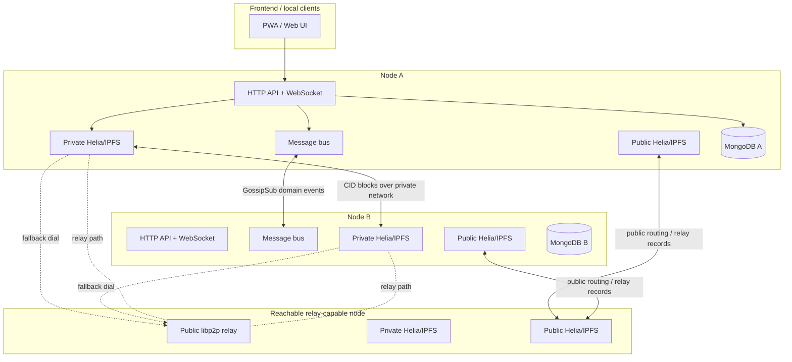
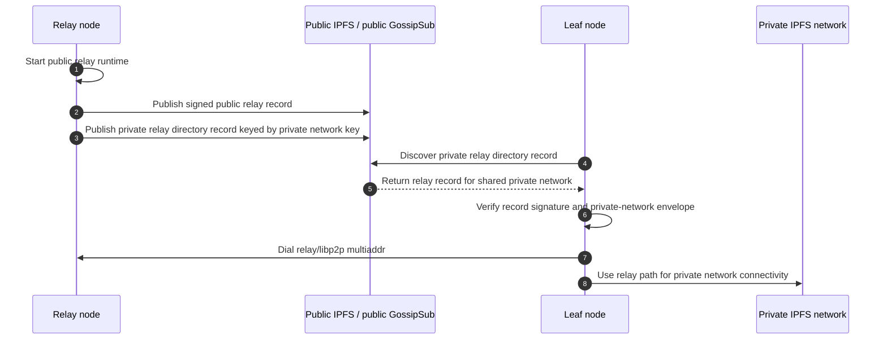
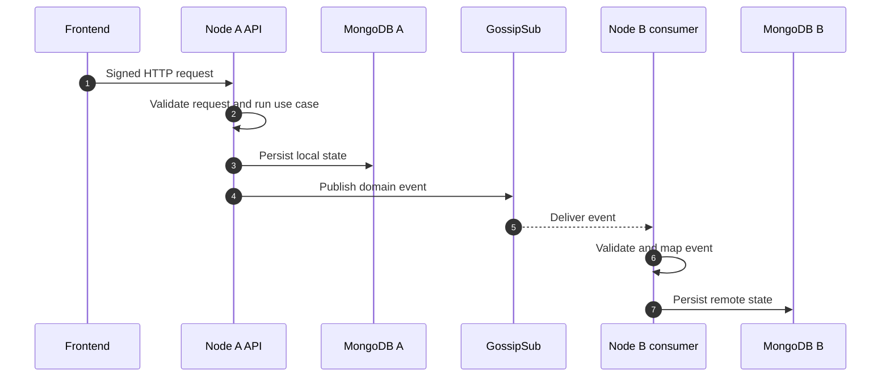
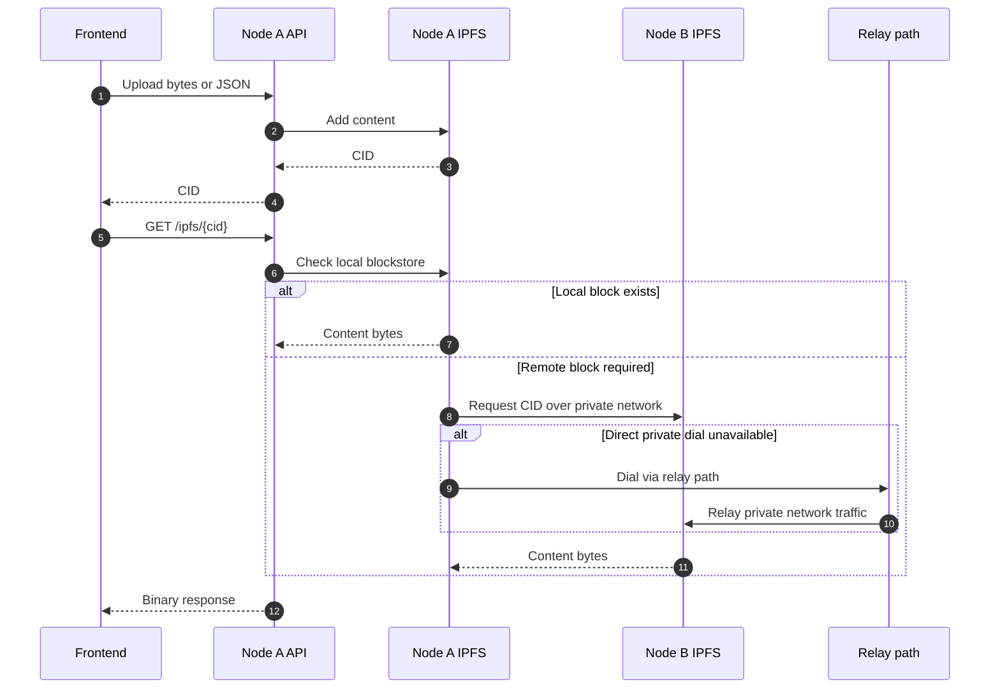

# P2P Communication

This document describes how Pigeon Swarm nodes communicate with each other, how
private networks relate to public relay discovery, and how IPFS content is
retrieved across nodes.

## Layers

Pigeon Swarm uses several network layers with different responsibilities:

* HTTP/WebSocket serves the frontend and local API clients.
* libp2p GossipSub synchronizes backend domain events between nodes.
* Helia/IPFS stores and retrieves content by CID.
* Private IPFS networks use a PSK-derived network key.
* The public relay path is fallback connectivity for nodes that cannot dial each
  other directly.
* MongoDB stores local application state, routing metadata, replication state,
  and peer heartbeats.



## Transport Modes

The backend transport is selected with `TRANSPORT_DSN`:

* `in-memory://`: local single-node development and tests.
* `libp2p-gossipsub://`: node-to-node event synchronization.

When GossipSub is enabled, domain events are published across libp2p. Consumers
on other nodes persist or update their own MongoDB state from those events.

Examples of synchronized data include identities, keychains, communities,
messages, calls, presence-adjacent node metadata, IPFS replication metadata, and
node heartbeats.

## Private Networks

Each configured node network creates an IPFS runtime. Private networks use a
network key. Nodes that do not share the same key cannot join that private IPFS
network or validate private relay records for it.

The private network is used for:

* encrypted message/event synchronization on the private transport path;
* IPFS block retrieval for content pinned in that network;
* routing metadata for identities, keychains, messages, and community data;
* replication policy decisions for CIDs that belong to that network.

The public relay path does not make private content public. It only helps two
private-network peers find a dialable path when direct connectivity is not
available.

## Relay Discovery

Relay-capable nodes can expose a public libp2p relay:

```env
PIGEON_RELAY_ENABLED=true
PIGEON_PUBLIC_HOST=<public-dns-or-ip>
PIGEON_LIBP2P_PORT=4001
PIGEON_RELAY_PORT=4011
```

`PIGEON_BOOTSTRAP_RELAY_MULTIADDRS` is optional. It is a manual override for
tests or deployments that want to force one or more known relay multiaddrs while
automatic relay discovery is warming up or unavailable. Normal leaf nodes should
be able to discover relays through the private relay directory when the public
IPFS routing layer can resolve the directory record.

Relay records are advertised in two places:

* public GossipSub topic `pigeon-swarm.public-relays.v1`;
* private relay directory records published through the public IPFS routing
  layer, keyed and encrypted from the private network key.

The private directory lets a node discover relays for a private network without
publishing the private network id, relay peer id, or relay multiaddrs in the
clear. Nodes outside the private network can see only an opaque encrypted
directory envelope. The envelope is stored inline in the routing record so a
leaf node does not need to fetch an additional public CID before it can decrypt
and dial the relay. Older CID-backed directory values are still accepted while
the network rolls forward. Because public DHT nodes do not necessarily accept
custom mutable record namespaces, relay nodes also publish a standard provider
record for a deterministic CID derived from the private lookup key. Leaf nodes
use that provider record as a fallback rendezvous when the custom routing record
is not available.



## Node Startup

At startup, a node:

1. Loads local node state and configured networks from MongoDB.
1. Starts private and public IPFS runtimes for the configured networks.
1. Starts the public relay runtime when enabled or auto-enabled.
1. Publishes local routing records.
1. Discovers private relay records.
1. Waits briefly for peer discovery per configured network.
1. Runs startup sync for the networks that are ready.
1. Starts schedulers for heartbeat, presence expiration, call timeout,
   replication maintenance, and routing-record republishing.

```mermaid
flowchart LR
  Start["Process start"] --> Load["Load local node state"]
  Load --> Networks["Start IPFS networks"]
  Networks --> Relay["Start relay runtime if enabled"]
  Relay --> Records["Publish local routing records"]
  Records --> Discover["Discover private relay records"]
  Discover --> Sync["Node startup sync"]
  Sync --> Ready["Ready"]
  Ready --> Schedulers["Schedulers keep state fresh"]
```



Startup sync is not a replacement for live gossip. It is a repair path: if a node
was offline, it can ask connected peers for missing identity, keychain,
conversation, and community data.

Readiness is evaluated per network. A network is ready when its local IPFS
runtime sees at least one peer before `STARTUP_SYNC_PEER_WAIT_MS` expires. Sync
requests for conversations and communities are published only for ready
networks. Networks without peers do not block healthy networks; they are retried
by later startup-sync attempts. After startup, a readiness monitor runs every
`STARTUP_SYNC_READY_MONITOR_MS` and triggers another sync when a previously
unready network becomes ready. Global identity and keychain repair requests are
published only when at least one network is ready.

## Domain Event Flow

When a user action changes backend state, the local node persists the change and
publishes a domain event. Remote nodes consume that event and update their own
state.



The event bus is eventually consistent. If a peer is disconnected, startup sync
and routing-record republishers are the fallback mechanisms that repair missing
state when the peer returns.

## IPFS Content Flow

The API stores and retrieves content by CID. Content can be JSON payloads or raw
bytes, depending on the endpoint and content type. For public binary retrieval,
the response is the binary payload, not a JSON/base64 wrapper.



## Replication Policy

IPFS replication is tracked separately from raw IPFS storage. Nodes do not have
to pin every CID forever. The replication policy decides which nodes should keep
local replicas, with generous margins so data is not lost when a small number of
nodes disconnects.

The replication status endpoint is intended for summary diagnostics. It should
not require scanning every known CID on every request.

## Diagnostics

Use these endpoints when debugging P2P behavior:

| Endpoint | Meaning | Source |
| --- | --- | --- |
| `GET /peers/` | Active application peers seen recently through node heartbeats. | MongoDB peer metadata |
| `GET /node/network/debug` | Runtime public relay state, advertised addresses, discovered relay records, and private relay directory counters. | In-memory relay/IPFS runtime |
| `GET /ipfs/{cid}` | Verifies whether the local node can retrieve a CID through local storage, private IPFS, or fallback relay connectivity. | Helia/IPFS |

Important distinction: `/peers/` does not necessarily mean there is a current
live libp2p connection. It shows active application peers based on recent
heartbeat metadata. `/node/network/debug` is the better endpoint for relay and
runtime connectivity diagnostics.

Useful log categories:

* `info`: startup, relay state, successful relay connections.
* `debug`: repeated network diagnostics, pubsub events, peer connect/disconnect
  events, relay discovery refreshes, and skipped DHT record publication batches.
* `warn`: actual degraded behavior that should be investigated.

If `DEBUG_NETWORK=true`, detailed network diagnostics are enabled for startup
addresses, peer connect/disconnect events and pubsub publish/receive activity.
These diagnostics are emitted at `debug` level, so they are visible only when
`DEBUG_NETWORK=true` and `LOG_LEVEL=debug`.

## Operational Notes

For a reachable relay node, DevOps must expose the libp2p ports configured for
that deployment:

* `PIGEON_LIBP2P_PORT`, commonly `4001`;
* `PIGEON_RELAY_PORT`, commonly `4011`.

The HTTP API port is not enough for libp2p/IPFS. Express cannot replace the
libp2p listener because the peer needs real libp2p multiaddrs for dialing,
GossipSub, routing, and relay behavior.

Public relay records are signed with the node libp2p key. Private directory
records are looked up and encrypted with keys derived from the private network
key. A node owner identity is not required for relay advertisement, because a
node can be unowned and identities do not have to be public.
